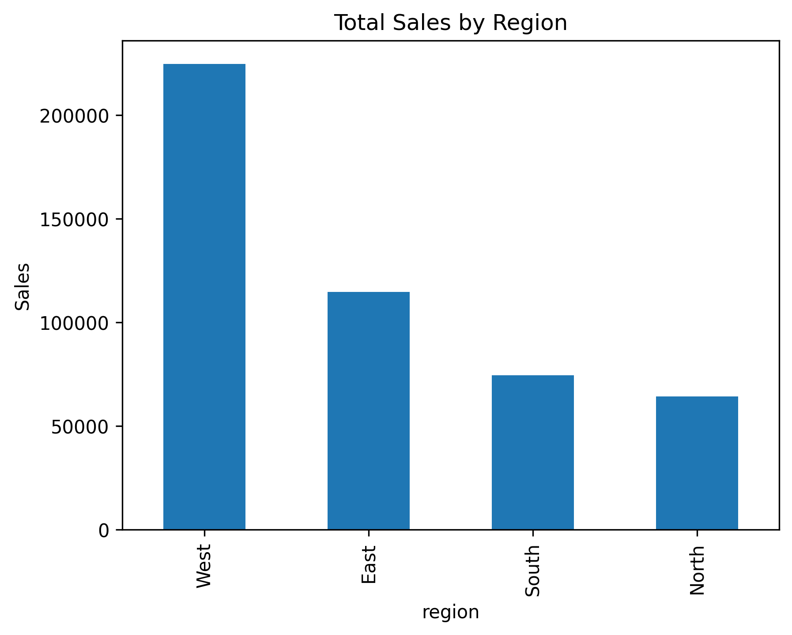
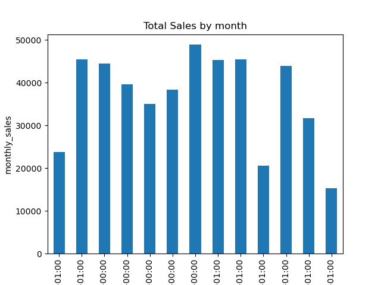

# 📊 Sales Analytics Pipeline

This project demonstrates an **simple end-to-end data pipeline** for analyzing retail sales data.

- **Extract & Load (ETL):** Load raw CSV files into a PostgreSQL database using Python.  
- **Transform:** Apply a normalized relational schema with foreign keys for proper joins.  
- **Analyze:** Use SQL to answer business questions like sales by region, top products, and customer behavior.  
- **Visualize:** Plot results using Pandas and Matplotlib.

---

## 🚀 Tech Stack

- PostgreSQL  
- Python (Pandas, SQLAlchemy, Psycopg2, Matplotlib)  
- VS Code, Git

---

## 📂 Project Structure

```
sales_analytics_pipeline/
├── data/                         # Raw CSV files
│   ├── customers.csv
│   ├── products.csv
│   ├── orders.csv
│   └── order_details.csv
│
├── sql/                               # Database schema
│   └── schema.sql
│
├── sql_queries/                       # Business insights queries
│   ├── 01_total_sales_by_region.sql
│   ├── 02_top_5_customers_by_spending.sql
│   ├── 03_monthly_sales_trend.sql
│   ├── 04_most_popular_product_per_category.sql
│   ├── 05_customers_without_orders.sql
│   └── README.md
│
├── plots/                             # Saved visualizations
│
├── load_files.py                      # ETL script: Load CSVs into PostgreSQL
├── python_analysis.py                 # Run analysis + generate plots
├── requirements.txt                   # Python dependencies
└── README.md                          # Project documentation
```

---

## ▶️ How to Run

1. **Setup PostgreSQL and create database**:
   ```sql
   CREATE DATABASE sales_db;
   \c sales_db
   \i sql/schema.sql
   ```

2. **Install Python dependencies**:
   ```bash
   pip install -r requirements.txt
   ```

3. **Load data into PostgreSQL**:
   ```bash
   python load_files.py
   ```

4. **Run analysis + generate plots**:
   ```bash
   python analyze_and_plot.py
   ```

---

## 📈 Example SQL Query: Total Sales by Region

```sql
SELECT c.region, ROUND(SUM(o.totalamount), 2) AS total_sales
FROM orders o
JOIN customers c ON c.customerid = o.customerid
GROUP BY c.region
ORDER BY total_sales DESC;
```

## 📊 Example Output

Here’s an example visualization from the project:





*💡 More queries can be found in the `sql_queries/` folder.*

---

## 🔮 Future Improvements

- Automate ETL with Airflow  
- Containerize with Docker for easy deployment  
- Add tests for data validation and schema checks

---

## 💡 Why This Project?

This project simulates a real-world scenario where a data engineer must:

- Handle raw CSVs  
- Design normalized schemas  
- Load and validate data  
- Write analytical SQL queries  
- Visualize and communicate insights  

Perfect for showcasing **ETL, SQL, and Python analytics** in one clean, production-like project.
